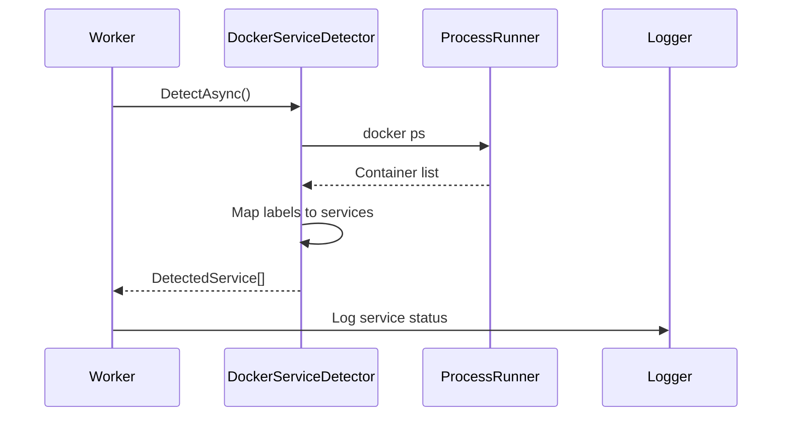
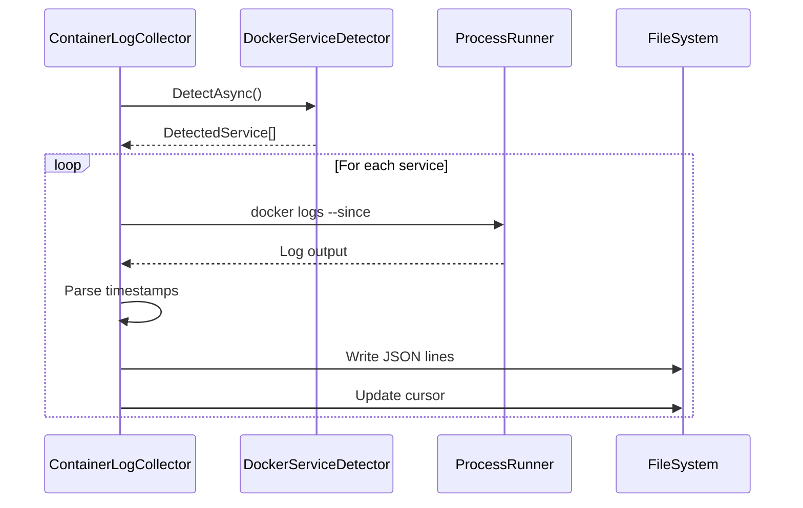
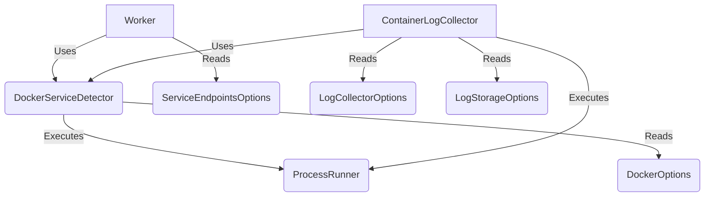

# System Architecture Analysis

## Core Components

### Worker Service (`Worker.cs`)
- Core orchestration loop running on 30-second intervals
- Startup sequence:
  1. Logs service endpoints (Ollama, OpenWebUI, StableDiffusion)
  2. Enters detection loop until shutdown
- Dependencies:
  - `IDockerServiceDetector` - Container discovery
  - `ServiceEndpointsOptions` - URL configuration
- Design patterns:
  - Background Service pattern
  - Dependency Injection
  - Options pattern for configuration

### Docker Service Detection (`DockerServiceDetector.cs`)
- Maps Docker containers to logical services
- Process flow:
  1. Executes `docker ps` with custom format
  2. Parses container metadata (ID, name, image, status)
  3. Maps containers using label selectors
- Dependencies:
  - `IProcessRunner` - Docker CLI abstraction
  - `DockerOptions` - Label selector config
- Design patterns:
  - Strategy pattern (via interface)
  - Command pattern (process execution)

### Log Collection (`ContainerLogCollector.cs`)
- Cursor-based log harvesting from containers
- Features:
  - JSON lines format for structured logging
  - Timestamp-based cursor to prevent duplicates
  - Configurable rotation and storage policies
- Process flow:
  1. Service detection
  2. Per-service log collection
  3. Cursor-based incremental appending
  4. Optional log rotation
- Dependencies:
  - `IDockerServiceDetector` - Container discovery
  - `IProcessRunner` - Docker logs command
  - Log configuration options

## Data Flow Patterns

### 1. Service Detection Flow


### 2. Log Collection Flow


## Configuration Patterns

### 1. Service Options
- `ServiceEndpointsOptions`: Base URLs for integrated services
- `DockerOptions`: Container detection and label mapping
- `LogCollectorOptions`: Collection intervals and rotation
- `LogStorageOptions`: Path configuration and naming

### 2. Runtime Settings
```json
{
  "ServiceEndpoints": {
    "Ollama": { "BaseUrl": "http://localhost:11434" },
    "OpenWebUI": { "BaseUrl": "http://localhost:3000" },
    "StableDiffusion": { "BaseUrl": "http://localhost:7860" }
  },
  "Docker": {
    "Detection": {
      "LabelSelector": {
        "open-webui": "shs.role=webui",
        "qdrant": "shs.role=vector-db",
        "automatic1111": "shs.role=diffusion"
      }
    }
  }
}
```

## Resource Management

### 1. Log Storage
- Directory structure:
  - `/logs/services/` - Container logs as JSON lines
  - `/logs/state/` - Timestamp cursors for incremental collection
- Rotation policies:
  - Size-based rotation with configurable thresholds
  - Age-based retention for historical logs

### 2. Process Management
- Docker CLI abstraction via `IProcessRunner`
- Cancellation support for graceful shutdown
- Error handling and retry logic

## Security Considerations

### 1. Container Isolation
- Label-based service identification
- Read-only access to Docker daemon
- Controlled log directory permissions

### 2. Data Protection
- Cursor-based log collection prevents duplicates
- Structured logging with sanitized input
- File system permission boundaries

## Testing Strategy

### 1. Unit Tests
- Mock-based testing via `IProcessRunner`
- Configuration validation
- Error handling verification

### 2. Integration Tests
```csharp
[Fact]
[Trait("Category", "Integration")]
public async Task FullStackScenario_RunsDetectionAndLogCollection()
{
    // Arrange core services
    var detector = new DockerServiceDetector(...);
    var worker = new Worker(...);
    var collector = new ContainerLogCollector(...);

    // Exercise detection flow
    await worker.DetectOnceAsync(token);
    
    // Verify log collection
    await collector.RunOnceAsync(token);
    
    // Assert expected behavior
    workerLogger.Entries.Should().Contain(...);
}
```

## Scalability Considerations

### 1. Resource Efficiency
- 30-second detection interval balances responsiveness
- Cursor-based incremental log collection
- Configurable rotation prevents unbounded growth

### 2. Extensibility
- Interface-based service detection
- Pluggable process runner abstraction
- Options pattern for runtime configuration

## Operational Notes

### 1. Service Health
- HTTP health endpoints for monitoring
- Structured logging for observability
- Container status tracking

### 2. Troubleshooting
- Detailed error logging
- Process exit code capture
- Container state validation

## Component Dependencies

